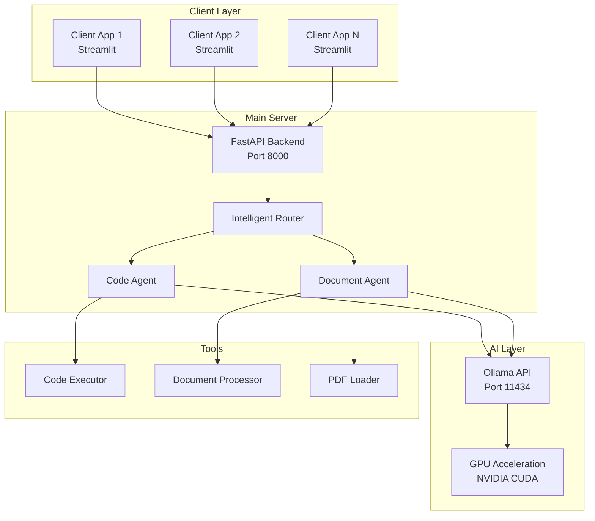
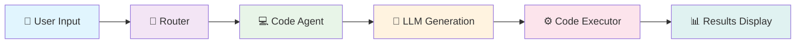
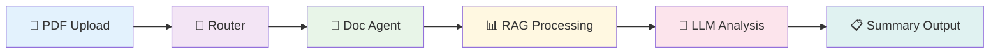
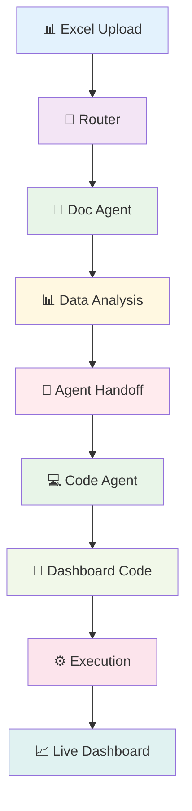
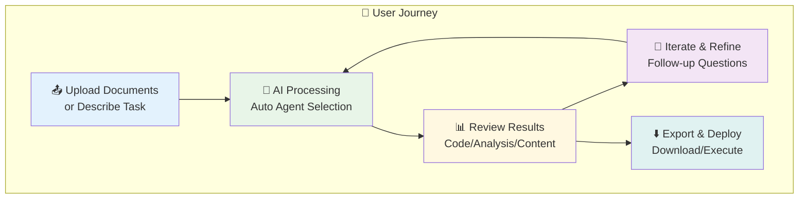

<div align="center">

# 🚀 Agentic AI Project

### *Next-Generation Multi-Agent AI System*

[](https://opensource.org/licenses/MIT)
[](https://www.python.org/downloads/)
[](https://www.docker.com/)
[](https://developer.nvidia.com/cuda-toolkit)

[](https://streamlit.io/)
[](https://fastapi.tiangolo.com/)
[](https://ollama.ai/)
[](https://developer.nvidia.com/tensorrt)


---

🤖 **A powerful agentic AI system that combines code generation, document processing, and intelligent task routing using advanced language models.**

*Built with cutting-edge AI agents, GPU acceleration, and enterprise-ready scalability*


### 🌟 **Star this repo** if you find it useful! ⭐

[🚀 **Quick Start**](#-quick-start) • 
[📖 **Documentation**](#-table-of-contents) • 
[🔧 **Model Config**](#-model-configuration) • 
[🏗️ **Architecture**](#️-architecture) • 
[💡 **Examples**](#-usage-examples) • 
[🐛 **Issues**](https://github.com/username/agentic-ai-project/issues)

</div>

## ✨ Key Features

<div align="center">

| Feature | Description | Status |
|---------|-------------|--------|
| 🤖 **Multi-Agent Architecture** | Specialized agents for code generation and document analysis | ✅ Active |
| 🚀 **GPU Acceleration** | NVIDIA GPU support for optimal performance | ✅ Active |
| 📄 **Document Processing** | PDF, text, and Excel file analysis with RAG capabilities | ✅ Active |
| 💻 **Code Execution** | Safe code generation and execution environment | ✅ Active |
| 🔄 **Distributed Deployment** | Support for main server + multiple client configurations | ✅ Active |
| 🎯 **Intelligent Routing** | Automatic task routing to appropriate agents | ✅ Active |
| 🐳 **Docker Ready** | One-command deployment with Docker Compose | ✅ Active |
| 🔧 **Model Flexibility** | Easy switching between different Ollama models | ✅ Active |

</div>

### 🎯 **What Makes This Special?**

- 🧠 **Smart Agent Selection**: Automatically routes tasks to the most suitable AI agent
- ⚡ **Lightning Fast**: GPU-accelerated inference with TensorRT optimization
- 🔒 **Production Ready**: Scalable architecture with Docker containerization
- 📊 **Real-time Processing**: Live document analysis and code execution
- 🌐 **Multi-Client Support**: Serve multiple users from a single GPU server
- 🔄 **Model Agnostic**: Switch between Llama, Mistral, CodeLlama, and more

## 🚀 Quick Start

<div align="center">

### 🔥 **Get Started in 2 Commands!**

**Local Development:**
```bash
git clone <repository-url> && cd Agentic-AI-Project-BDL
python dev.py  # Auto-detects TensorRT or Ollama
```

**Docker Deployment:**
```bash
git clone <repository-url> && cd Agentic-AI-Project-BDL
chmod +x deploy.sh && ./deploy.sh main
```

</div>

### ⚡ Prerequisites

<details>
<summary>📋 <strong>System Requirements (Click to expand)</strong></summary>

#### 🔧 **Required**
- 🐳 [Docker](https://docs.docker.com/get-docker/) (20.10+) and [Docker Compose](https://docs.docker.com/compose/install/) (2.0+)
- 🖥️ Linux/Windows/macOS (x64)
- 💾 **8GB+ RAM** (16GB recommended)
- 💿 **10GB+ free disk space**

#### 🎮 **Recommended**
- 🔥 NVIDIA GPU with [CUDA drivers](https://developer.nvidia.com/cuda-downloads) (11.8+)
- ⚡ **RTX 3060** or better (8GB+ VRAM)
- 🏃‍♂️ **16+ CPU cores** for optimal performance

#### 🧪 **Development Options**

<details>
<summary>🔧 <strong>Advanced Local Setup (Click to expand)</strong></summary>

```bash
# Force specific provider
python dev.py --tensorrt    # Use TensorRT-LLM only
python dev.py --ollama      # Use Ollama only

# Install dependencies only
python dev.py --setup       # Setup without starting

# Manual Streamlit (after setup)
cd frontend && streamlit run app.py
```

**🎯 Provider Priority:**
1. **TensorRT-LLM** (localhost:8000) - Best performance
2. **Ollama** (localhost:11434) - Auto-installed fallback

</details>

</details>

### 🎯 **Deployment Options**

<div align="center">

| Deployment Type | Command | Best For | Resources |
|----------------|---------|----------|-----------|
| 🏠 **Single Server** | `./deploy.sh main` | Development, Testing | 1 GPU, 8GB RAM |
| 🌐 **Multi-Client** | `./deploy.sh client 1` | Teams, Production | Shared GPU |
| 🔧 **Manual Setup** | See [DEPLOYMENT_GUIDE.md](DEPLOYMENT_GUIDE.md) | Custom Configs | Variable |

</div>

### ⚡ **One-Command Setup**

<div align="center">

**🖥️ Local Development** | **🐳 Docker Deployment**

</div>

#### 🖥️ **Local Development (Simplified)**
```bash
# 1️⃣ Clone and navigate
git clone <repository-url>
cd Agentic-AI-Project-BDL

# 2️⃣ Complete setup with dependencies, Ollama, and models
python setup-dev.py
```

#### 🐳 **Docker Deployment (Production)**
```bash
# 1️⃣ Main server deployment
chmod +x deploy.sh && ./deploy.sh main

# 2️⃣ Additional clients (optional)
./deploy.sh client 1  # Port 8501
./deploy.sh client 2  # Port 8502
```

<div align="center">

### 🌐 **Access Your AI System**

🎉 **Main Application**: [`http://localhost:8501`](http://localhost:8501)  
🔧 **API Documentation**: [`http://localhost:8000/docs`](http://localhost:8000/docs)  
🤖 **Ollama API**: [`http://localhost:11434`](http://localhost:11434)

**🚀 Ready to start creating with AI!**

</div>

## 📋 Table of Contents

<div align="center">

**📖 Navigation Guide**

</div>

| Section | Description | 🔗 |
|---------|-------------|---|
| 🔧 **[Model Configuration](#-model-configuration)** | Switch between AI models | 🎯 |
| 🏗️ **[Architecture](#️-architecture)** | System design & components | 🏛️ |
| 🚀 **[Deployment Options](#-deployment-options)** | Setup & scaling guides | 🎛️ |
| 💡 **[Usage Examples](#-usage-examples)** | Real-world use cases | 🎪 |
| 🛠️ **[Configuration Files](#️-configuration-files)** | Customize your setup | ⚙️ |
| 🐛 **[Troubleshooting](#-troubleshooting)** | Common fixes & solutions | 🔧 |
| 👨‍💻 **[Development](#-development)** | Contributing & extending | 🚧 |
| 📊 **[Performance](#-performance)** | Optimization tips | ⚡ |
| 🤝 **[Contributing](#-contributing)** | Join the community | 💪 |
| 📄 **[License](#-license)** | MIT License details | 📋 |

## 🔧 Model Configuration

### 🎯 Switching Ollama Models

The system is configured to use **Mistral 7B** by default. You can switch to different Ollama models by following these steps:

#### 📊 Available Models

| Model | Size | Memory | Performance | Use Case |
|-------|------|--------|-------------|----------|
| `mistral:7b` ⭐ | 4.1GB | 8GB+ | ⚡⚡⚡ | **Default** - Balanced performance |
| `llama3.2:1b` | 1.3GB | 4GB+ | ⚡⚡⚡⚡ | Lightweight, faster responses |
| `llama3.2:3b` | 2.0GB | 6GB+ | ⚡⚡⚡ | Good balance of speed and quality |
| `llama3.1:8b` | 4.7GB | 8GB+ | ⚡⚡ | High quality responses |
| `codellama:7b` | 3.8GB | 8GB+ | ⚡⚡⚡ | 🐍 Specialized for code tasks |
| `phi3:mini` | 2.3GB | 4GB+ | ⚡⚡⚡⚡ | 🏢 Microsoft's efficient model |
| `gemma2:2b` | 1.6GB | 4GB+ | ⚡⚡⚡⚡ | 🔍 Google's lightweight model |

#### 🔧 Method 1: Update Configuration Files (Recommended)

<details>
<summary>🎯 <strong>Click to expand step-by-step instructions</strong></summary>

1. **Update the main configuration:**

```bash
# Edit the main config file
nano config/app_config.py
```

Change the model in `LLM_CONFIG`:
```python
LLM_CONFIG = {
    "provider": "tensorrt",
    "model": "llama3.2:3b",  # 👈 Change this line
    "temperature": 0.7,
    "max_tokens": 1000
}
```

2. **Update the Ollama provider default:**

```bash
# Edit the Ollama provider
nano backend/llm_providers/ollama_provider.py
```

Change the default model:
```python
def __init__(
    self, 
    model_name: str = "llama3.2:3b",  # 👈 Change this line
    temperature: float = 0.7,
    max_tokens: int = 2000,
    base_url: str = None
):
```

3. **Update Docker Compose files:**

```bash
# Update all Docker Compose files at once
sed -i 's/LLM_MODEL=mistral:7b/LLM_MODEL=llama3.2:3b/g' deployment/docker-compose.*.yml
```

4. **Update deployment script:**

```bash
# Edit deploy.sh
nano deploy.sh
```

Change the model pull command:
```bash
# From:
docker exec agentic-ollama-main ollama pull mistral:7b

# To:
docker exec agentic-ollama-main ollama pull llama3.2:3b
```

</details>

#### ⚡ Method 2: Environment Variables (Quick & Temporary)

```bash
# Set environment variable before deployment
export LLM_MODEL="llama3.2:3b"

# Deploy with the new model
./deploy.sh main
```

#### 🔄 Method 3: Runtime Model Switch

<details>
<summary>🔧 <strong>Switch models on running system</strong></summary>

1. **Pull the new model:**
```bash
# Connect to Ollama container
docker exec -it agentic-ollama-main bash

# Pull new model
ollama pull llama3.2:3b

# List available models
ollama list

# Exit container
exit
```

2. **Restart with new model:**
```bash
# Stop current deployment
cd deployment
docker compose -f docker-compose.main-server-gpu.yml down

# Set new model and restart
export LLM_MODEL="llama3.2:3b"
docker compose -f docker-compose.main-server-gpu.yml up -d
```

</details>

#### 🎛️ Method 4: Multiple Models (Advanced)

```bash
# Pull multiple models for switching
docker exec agentic-ollama-main ollama pull mistral:7b
docker exec agentic-ollama-main ollama pull llama3.2:3b
docker exec agentic-ollama-main ollama pull codellama:7b

# List all available models
docker exec agentic-ollama-main ollama list

# Switch by updating environment variable and restarting
```

### Model-Specific Configurations

#### For Code-Heavy Tasks (Recommended: CodeLlama)

```python
LLM_CONFIG = {
    "provider": "tensorrt",
    "model": "codellama:7b",
    "temperature": 0.1,  # Lower temperature for code
    "max_tokens": 2000   # More tokens for code generation
}
```

#### For Resource-Constrained Environments

```python
LLM_CONFIG = {
    "provider": "tensorrt", 
    "model": "llama3.2:1b",
    "temperature": 0.7,
    "max_tokens": 500    # Reduced for faster responses
}
```

#### For Document Analysis Tasks

```python
LLM_CONFIG = {
    "provider": "tensorrt",
    "model": "mistral:7b",
    "temperature": 0.3,  # Lower temperature for factual responses
    "max_tokens": 1500   # More tokens for detailed analysis
}
```

### Verifying Model Switch

After switching models, verify the change:

1. **Check backend logs:**
```bash
docker logs agentic-backend-main | grep -i model
```

2. **Test API endpoint:**
```bash
curl http://localhost:8000/health
```

3. **Check Ollama directly:**
```bash
curl http://localhost:11434/api/tags
```

4. **Test in the web interface:**
   - Go to `http://localhost:8501`
   - Send a message
   - Check the sidebar for agent/model information

## 🏗️ Architecture

### 🔧 System Components



### 🤖 Agent System

| Component | Function | Specialization |
|-----------|----------|----------------|
| **🧭 Router** | Task Analysis & Routing | Intelligently routes requests to appropriate agents |
| **💻 Code Agent** | Code Generation & Analysis | Python, JavaScript, algorithms, debugging |
| **📄 Document Agent** | Document Processing | PDF analysis, summarization, Q&A with RAG |
| **⚙️ Code Executor** | Safe Code Execution | Sandboxed Python code execution |
| **📎 Document Processor** | File Processing | Multi-format document parsing and analysis |

## 🚀 Deployment Options

## 🚀 Deployment Options

### 🏠 Option 1: Single Server (Simple)
```bash
./deploy.sh main
```
**Perfect for:**
- ✅ Development and testing
- ✅ Single-user environments
- ✅ Full feature access

**Requirements:**
- 🎮 GPU recommended
- 💾 8GB+ RAM
- 💿 Single instance

### 🌐 Option 2: Distributed Architecture (Scalable)
```bash
# 1. Deploy main server (once)
./deploy.sh main

# 2. Deploy multiple clients (as needed)
./deploy.sh client 1  # Port 8501
./deploy.sh client 2  # Port 8502  
./deploy.sh client 3  # Port 8503
```
**Perfect for:**
- ✅ Multi-user environments
- ✅ Team collaboration
- ✅ Resource sharing
- ✅ Horizontal scaling

**Architecture:**
- 🏢 One powerful main server (GPU-enabled)
- 👥 Multiple lightweight client interfaces
- 🔄 Shared AI model resources

### 🔧 Option 3: Manual Deployment (Advanced)
See [📖 DEPLOYMENT_GUIDE.md](DEPLOYMENT_GUIDE.md) for detailed manual setup instructions.

## 💡 Usage Examples

<div align="center">

### 🎯 **Real-World Use Cases**

*See the AI agents in action with these practical examples*

</div>

### 💻 Code Generation & Execution

<details>
<summary>🐍 <strong>Example: Fibonacci Calculator (Click to expand)</strong></summary>

**Input:**
```
"Create a Python function to calculate fibonacci numbers and test it with n=10"
```

**System Flow:**


**Generated Output:**
```python
def fibonacci(n):
    """Calculate the nth Fibonacci number efficiently."""
    if n <= 1:
        return n
    
    a, b = 0, 1
    for _ in range(2, n + 1):
        a, b = b, a + b
    return b

# Test execution
result = fibonacci(10)
print(f"Fibonacci(10) = {result}")  # Output: 55
```

**✅ Results:**
- ✅ Generated optimized Fibonacci function
- ✅ Executed with test case (n=10 → 55)
- ✅ Performance analysis included
- ✅ Code explanation provided

</details>

### 📄 Document Analysis & Q&A

<details>
<summary>📊 <strong>Example: PDF Report Analysis (Click to expand)</strong></summary>

**Input:**
- 📎 Upload: `quarterly_report_Q4_2024.pdf`
- 💬 Query: `"Summarize the key findings and create an executive summary"`

**System Flow:**


**Generated Output:**
```markdown
# Executive Summary - Q4 2024

## 🎯 Key Findings
- **Revenue Growth**: 15% increase over Q3 2024
- **Market Expansion**: Entered 3 new international markets
- **Customer Satisfaction**: 94% retention rate

## 📊 Financial Highlights
- Total Revenue: $2.4M (+15% QoQ)
- Operating Margin: 23% (+2% QoQ)
- Cash Flow: $850K positive

## 🚀 Strategic Initiatives
1. AI/ML product development (+30% investment)
2. International expansion (EU, APAC)
3. Customer success program launch
```

**✅ Results:**
- ✅ Extracted 47 pages of content
- ✅ Generated executive summary
- ✅ Identified key metrics & trends
- ✅ Interactive Q&A enabled

</details>

### 🔄 Multi-Agent Collaboration

<details>
<summary>📈 <strong>Example: Excel Data Dashboard (Click to expand)</strong></summary>

**Input:**
- 📊 Upload: `sales_data_2024.xlsx`
- 💬 Query: `"Analyze this dataset and create a visualization dashboard with Python"`

**System Flow:**


**Generated Python Dashboard:**
```python
import pandas as pd
import plotly.graph_objects as go
import streamlit as st

# Data analysis results
df = pd.read_excel('sales_data_2024.xlsx')
monthly_sales = df.groupby('month')['revenue'].sum()

# Interactive dashboard
fig = go.Figure()
fig.add_trace(go.Scatter(
    x=monthly_sales.index,
    y=monthly_sales.values,
    mode='lines+markers',
    name='Monthly Revenue'
))

st.plotly_chart(fig, use_container_width=True)
```

**✅ Results:**
- ✅ Analyzed 12 months of sales data
- ✅ Generated interactive Plotly dashboard
- ✅ Identified seasonal trends (+25% Q4 boost)
- ✅ Created executable Python code
- ✅ Live dashboard deployed

</details>

### 🛠️ **Development Workflow**

<div align="center">

**🔄 Typical AI-Powered Workflow**

</div>



### 🎪 **Live Demo Examples**

<div align="center">

| Use Case | Demo | Description |
|----------|------|-------------|
| 🐍 **Code Generation** | [Try it →](http://localhost:8501) | Generate, test, and execute Python code |
| 📄 **Document Q&A** | [Try it →](http://localhost:8501) | Upload PDFs and ask questions |
| 📊 **Data Analysis** | [Try it →](http://localhost:8501) | Process Excel files and create visualizations |
| 🔧 **API Integration** | [Docs →](http://localhost:8000/docs) | Integrate with your applications |

</div>

## 🛠️ Configuration Files

<div align="center">

### ⚙️ **System Configuration Overview**

*Customize your AI system with these key configuration files*

</div>

| File | Purpose | Key Settings | 🔧 |
|------|---------|--------------|---|
| 📝 `config/app_config.py` | Main application config | Model selection, API settings | [Edit](#) |
| 🤖 `config/llm_config.py` | LLM-specific settings | Temperature, tokens, providers | [Edit](#) |
| 🐳 `deployment/docker-compose.*.yml` | Container configurations | Ports, volumes, environments | [Edit](#) |
| 🚀 `deploy.sh` | Automated deployment script | Model pulling, container management | [Edit](#) |

### 🔧 **Quick Configuration Examples**

<details>
<summary>⚙️ <strong>Model Performance Tuning (Click to expand)</strong></summary>

#### 🎯 **High-Quality Responses**
```python
# config/app_config.py
LLM_CONFIG = {
    "provider": "tensorrt",
    "model": "llama3.1:8b",
    "temperature": 0.2,     # Lower = more focused
    "max_tokens": 2000,     # More detailed responses
    "top_p": 0.9           # Nucleus sampling
}
```

#### ⚡ **Fast Performance**
```python
# config/app_config.py
LLM_CONFIG = {
    "provider": "tensorrt", 
    "model": "llama3.2:1b",
    "temperature": 0.7,
    "max_tokens": 500,      # Shorter, faster responses
    "top_p": 0.95
}
```

#### 💻 **Code-Optimized**
```python
# config/app_config.py
LLM_CONFIG = {
    "provider": "tensorrt",
    "model": "codellama:7b",
    "temperature": 0.1,     # Very focused for code
    "max_tokens": 3000,     # Longer code blocks
    "top_p": 0.8
}
```

</details>

<details>
<summary>🐳 <strong>Docker Environment Variables (Click to expand)</strong></summary>

#### 🌍 **Environment Configuration**
```yaml
# deployment/docker-compose.main-server-gpu.yml
environment:
  - LLM_MODEL=mistral:7b         # Model selection
  - CUDA_VISIBLE_DEVICES=0       # GPU assignment
  - OLLAMA_HOST=0.0.0.0:11434   # API host
  - PYTHONPATH=/app             # Python path
  - LOG_LEVEL=INFO              # Logging level
```

#### 🔧 **Resource Limits**
```yaml
# Docker resource configuration
deploy:
  resources:
    limits:
      memory: 16G               # RAM limit
      cpus: '8'                # CPU cores
    reservations:
      devices:
        - driver: nvidia        # GPU reservation
          count: 1
```

</details>

## 🐛 Troubleshooting

<div align="center">

### 🔧 **Common Issues & Solutions**

*Quick fixes for the most frequent problems*

</div>

### ❗ **Installation Issues**

<details>
<summary>🚫 <strong>Model Not Found Error (Click to expand)</strong></summary>

```bash
# ❌ Error: "model 'mistral:7b' not found"

# ✅ Solution: Pull the model manually
docker exec agentic-ollama-main ollama pull mistral:7b

# 🔍 Verify installation
docker exec agentic-ollama-main ollama list
```

**🎯 Alternative models if download fails:**
- `llama3.2:1b` (smaller, faster download)
- `phi3:mini` (Microsoft's efficient model)
- `gemma2:2b` (Google's lightweight model)

</details>

<details>
<summary>💾 <strong>Out of Memory Issues (Click to expand)</strong></summary>

```bash
# ❌ Error: "CUDA out of memory" or "OOM"

# ✅ Solution 1: Switch to smaller model
export LLM_MODEL="llama3.2:1b"
./deploy.sh main

# ✅ Solution 2: Reduce batch size
# Edit config/app_config.py
LLM_CONFIG = {
    "model": "llama3.2:1b",
    "max_tokens": 500,  # Reduce token limit
    "temperature": 0.7
}

# ✅ Solution 3: Use CPU-only mode
cd deployment
docker compose -f docker-compose.main-server.yml up -d
```

**🎮 GPU Memory Requirements:**
- **1B models**: 2GB VRAM
- **3B models**: 4GB VRAM  
- **7B models**: 8GB VRAM
- **8B+ models**: 12GB+ VRAM

</details>

<details>
<summary>🎮 <strong>GPU Not Detected (Click to expand)</strong></summary>

```bash
# ❌ Error: "NVIDIA-SMI has failed" or GPU not found

# ✅ Solution 1: Install NVIDIA Docker support
sudo apt-get update
sudo apt-get install -y nvidia-docker2
sudo systemctl restart docker

# ✅ Solution 2: Verify GPU drivers
nvidia-smi
docker run --rm --gpus all nvidia/cuda:11.8-base nvidia-smi

# ✅ Solution 3: Check Docker GPU access
docker run --rm --gpus all ubuntu nvidia-smi
```

**🔧 GPU Setup Checklist:**
- [ ] NVIDIA drivers installed (470+)
- [ ] Docker with GPU support
- [ ] nvidia-docker2 package
- [ ] CUDA toolkit (optional but recommended)

</details>

### 🌐 **Network & Port Issues**

<details>
<summary>🔌 <strong>Port Already in Use (Click to expand)</strong></summary>

```bash
# ❌ Error: "Port 8000 already in use"

# 🔍 Check what's using the port
sudo netstat -tulpn | grep :8000
sudo lsof -i :8000

# ✅ Solution 1: Stop conflicting service
sudo kill -9 <PID>

# ✅ Solution 2: Use different ports
# Edit docker-compose files to use alternative ports
# 8001, 8002, etc.

# ✅ Solution 3: Clean up previous containers
docker ps -a
docker stop $(docker ps -aq)
docker rm $(docker ps -aq)
```

</details>

### 📊 **Performance Issues**

<details>
<summary>⚡ <strong>Slow Response Times (Click to expand)</strong></summary>

**🎯 Optimization Strategies:**

1. **Model Selection:**
```bash
# Fast models for development
export LLM_MODEL="llama3.2:1b"  # ~2-3s response

# Balanced models for production  
export LLM_MODEL="mistral:7b"    # ~5-8s response
```

2. **GPU Acceleration:**
```bash
# Ensure GPU deployment
./deploy.sh main  # Uses GPU by default

# Check GPU utilization
nvidia-smi -l 1
```

3. **Resource Allocation:**
```yaml
# Increase Docker resources
deploy:
  resources:
    limits:
      memory: 32G
      cpus: '16'
```

</details>

### 🔍 **Debugging & Monitoring**

```bash
# 📊 Check all containers
docker ps

# 📝 View real-time logs
docker logs agentic-backend-main -f
docker logs agentic-ollama-main -f
docker logs agentic-frontend-main -f

# 💻 System resource monitoring
docker stats

# 🔧 Enter container for debugging
docker exec -it agentic-backend-main bash
docker exec -it agentic-ollama-main bash

# 🌐 Test API endpoints
curl http://localhost:8000/health
curl http://localhost:11434/api/tags
```

### 🆘 **Getting Help**

<div align="center">

| Issue Type | Solution | 🔗 |
|------------|----------|---|
| 🐛 **Bugs** | [Create Issue](https://github.com/username/agentic-ai-project/issues) | 🎯 |
| ❓ **Questions** | [GitHub Discussions](https://github.com/username/agentic-ai-project/discussions) | 💬 |
| 📖 **Documentation** | [DEPLOYMENT_GUIDE.md](DEPLOYMENT_GUIDE.md) | 📋 |
| 💬 **Community** | [Discord/Slack](#) | 🤝 |

</div>

## 📊 Performance

<div align="center">

### ⚡ **Optimization Guide**

*Get the best performance from your AI system*

</div>

### 🎯 **Model Selection by Use Case**

| Use Case | Recommended Model | Memory | Speed | Quality |
|----------|------------------|--------|-------|---------|
| 🧪 **Development/Testing** | `llama3.2:1b` | 4GB | ⚡⚡⚡⚡⚡ | ⭐⭐⭐ |
| 🏢 **Production/General** | `mistral:7b` | 8GB | ⚡⚡⚡⚡ | ⭐⭐⭐⭐⭐ |
| 💻 **Code Generation** | `codellama:7b` | 8GB | ⚡⚡⚡ | ⭐⭐⭐⭐⭐ |
| 📄 **Document Analysis** | `mistral:7b` | 8GB | ⚡⚡⚡⚡ | ⭐⭐⭐⭐⭐ |
| 🎯 **High Quality** | `llama3.1:8b` | 12GB | ⚡⚡⚡ | ⭐⭐⭐⭐⭐ |

### 💻 **Hardware Requirements**

<details>
<summary>🖥️ <strong>System Specifications (Click to expand)</strong></summary>

#### 🎮 **GPU Recommendations**

| GPU Model | VRAM | Supported Models | Performance |
|-----------|------|------------------|-------------|
| **RTX 4090** | 24GB | All models | 🔥🔥🔥🔥🔥 |
| **RTX 4080** | 16GB | Up to 8B | 🔥🔥🔥🔥 |
| **RTX 3080** | 10GB | Up to 7B | 🔥🔥🔥 |
| **RTX 3060** | 8GB | Up to 7B | 🔥🔥 |
| **GTX 1660** | 6GB | Up to 3B | 🔥 |

#### 💾 **Memory & Storage**

| Component | Minimum | Recommended | Optimal |
|-----------|---------|-------------|---------|
| **RAM** | 8GB | 16GB | 32GB+ |
| **Storage** | 20GB | 50GB | 100GB+ |
| **CPU** | 4 cores | 8 cores | 16+ cores |

</details>

### 🚀 **Performance Optimization Tips**

<details>
<summary>⚡ <strong>Speed Optimization (Click to expand)</strong></summary>

#### 🎯 **Model Configuration**
```python
# Fast response configuration
LLM_CONFIG = {
    "model": "llama3.2:1b",
    "temperature": 0.7,
    "max_tokens": 500,        # Shorter responses
    "top_p": 0.95,           # Focused sampling
    "repeat_penalty": 1.1    # Avoid repetition
}
```

#### 🐳 **Docker Optimization**
```yaml
# Resource allocation
deploy:
  resources:
    limits:
      memory: 16G
      cpus: '8'
    reservations:
      memory: 8G
      cpus: '4'
```

#### 🔄 **Caching Strategies**
- Enable model caching in Ollama
- Use persistent volumes for model storage
- Implement response caching for repeated queries

</details>

### 📈 **Scaling Considerations**

<div align="center">

**🌐 Deployment Scaling Guide**

</div>

| Users | Architecture | Hardware | Configuration |
|-------|-------------|----------|---------------|
| **1-5** | Single Server | 1x GPU, 16GB RAM | Standard deployment |
| **5-20** | Main + 3 Clients | 1x GPU, 32GB RAM | Load balancing |
| **20+** | Multi-GPU Cluster | 2+ GPUs, 64GB+ RAM | Kubernetes/Swarm |

## 🤝 Contributing

<div align="center">

### 🌟 **Join Our Community!**

We welcome contributions from developers, researchers, and AI enthusiasts!

[](https://github.com/username/agentic-ai-project/graphs/contributors)
[](https://github.com/username/agentic-ai-project/pulls)

</div>

### 🚀 **How to Contribute**

<details>
<summary>📝 <strong>Contribution Guidelines (Click to expand)</strong></summary>

#### 🎯 **Ways to Contribute**
- 🐛 **Bug Reports**: Found a bug? [Create an issue](https://github.com/username/agentic-ai-project/issues/new)
- 💡 **Feature Requests**: Have an idea? [Request a feature](https://github.com/username/agentic-ai-project/issues/new)
- 📖 **Documentation**: Improve docs, add examples, fix typos
- 🧪 **Testing**: Test new models, report compatibility issues
- 💻 **Code**: Add new agents, tools, or optimizations

#### 🔄 **Development Workflow**
1. 🍴 **Fork** the repository
2. 🌿 **Create** a feature branch (`git checkout -b feature/amazing-feature`)
3. 🧪 **Test** with multiple models and configurations
4. 📝 **Commit** your changes (`git commit -m 'Add amazing feature'`)
5. 🚀 **Push** to the branch (`git push origin feature/amazing-feature`)
6. 🎉 **Submit** a pull request

#### 🧪 **Testing Checklist**
- [ ] Test with different AI models (Mistral, Llama, CodeLlama)
- [ ] Verify GPU and CPU compatibility
- [ ] Check both single-server and distributed deployments
- [ ] Validate documentation updates
- [ ] Ensure code follows project style

</details>

### 🏆 **Contributors Hall of Fame**

<div align="center">

*Thank you to all our amazing contributors!*

<!-- This will auto-populate with actual contributors when hosted on GitHub -->
<a href="https://github.com/username/agentic-ai-project/graphs/contributors">
  
</a>

**🌟 Be the next contributor!**

</div>

## 📊 **Project Stats & Activity**

<div align="center">


</div>

## 📄 License

<div align="center">

### 📋 **MIT License**

This project is licensed under the **MIT License** - see the [LICENSE](LICENSE) file for details.

[](https://opensource.org/licenses/MIT)

**🎉 Free to use, modify, and distribute!**

</div>

---

<div align="center">

## 🚀 **Ready to Get Started?**

### **[⚡ Quick Start](#-quick-start)** • **[📖 Documentation](#-table-of-contents)** • **[🤝 Contribute](#-contributing)**

---

### 💬 **Support & Community**

📖 **Documentation**: [DEPLOYMENT_GUIDE.md](DEPLOYMENT_GUIDE.md)  
🐛 **Issues**: [GitHub Issues](https://github.com/username/agentic-ai-project/issues)  
💬 **Discussions**: [GitHub Discussions](https://github.com/username/agentic-ai-project/discussions)  
📧 **Contact**: [your-email@domain.com](mailto:your-email@domain.com)

---

### ⭐ **Show Your Support**

If this project helped you, please consider:
- ⭐ **Starring** the repository
- 🐛 **Reporting** bugs and issues  
- 🤝 **Contributing** to the codebase
- 📢 **Sharing** with your network

**Built with ❤️ by the open-source community**

*Last updated: June 2025*

</div>